# Codebase Overview

This repository implements a Python CLI tool for AI-assisted job outreach. It loads contacts from CSV, extracts resume/profile text, optionally fetches public company/job pages, asks OpenAI for a structured outreach email, validates the result, writes local artifacts, and optionally sends email over SMTP SSL.

Major directories and files:

- `main.py`: thin CLI executable entrypoint; imports and calls `outreach.cli.main`.
- `outreach/cli.py`: orchestration layer for argument parsing, settings loading, contact loop, research, prompt construction, OpenAI generation, validation, artifact writing, and optional sending.
- `outreach/config.py`: Pydantic settings loaded from environment variables and `.env`; validates OpenAI, SMTP, rate limit, HTTP, and text-size settings.
- `outreach/models.py`: shared domain models (`Contact`, `GeneratedEmail`, `ResearchResult`, `ResumeProfile`, `ValidationResult`, `Tone`).
- `outreach/ai/openai_client.py`: async OpenAI Responses API integration with JSON schema output validation and retry behavior.
- `outreach/research/fetcher.py`: async public HTTP fetcher with robots.txt checks, redirect checks, DNS/IP safety validation, size limits, and HTML-to-text extraction.
- `outreach/email/sender.py`: plain-text email rendering, `.eml` writing, and optional SMTP SSL sending in a worker thread.
- `outreach/resume/parser.py`: PDF/TXT/MD resume and portfolio text extraction with file and page limits.
- `outreach/prompts.py`: prompt-file loading and user prompt construction.
- `outreach/validation/email_quality.py`: deterministic validation for subject/body quality and send safety.
- `outreach/utils/`: CSV loading, filesystem privacy helpers, logging setup, and async rate limiting.
- `prompts/system_prompt.md`: system prompt used for OpenAI email generation.
- `data/`: example input files only; runtime input paths are supplied by CLI flags.
- `tests/`: unit tests for CSV parsing, logging, OpenAI response parsing, prompt construction, rate limiting, research fetch safety, resume parsing, email sender behavior, and validation.
- `requirements.txt`: runtime and test dependencies.
- `requirements-dev.txt`: optional security/type/lint tooling.
- `pyproject.toml`: pytest and Ruff configuration.
- `.env.example`: documented environment variables.
- `.gitignore`: excludes `.env`, virtualenvs, caches, `outputs/`, and `logs/`.

No Docker, Kubernetes, Terraform, compose file, package build backend, GitHub Actions, or other CI/CD definition was found in the repository file list.

# Key Entrypoints

- CLI executable: `python main.py --contacts ... --resume ...`
- Python call path: `main.py` -> `outreach.cli.main()` -> `asyncio.run(outreach.cli.run(args))`
- Main workflow function: `outreach.cli.run`
- Per-contact workflow function: `outreach.cli.process_contact`

Runtime CLI flags from `outreach/cli.py`:

- `--contacts`: required CSV path.
- `--resume`: required PDF/TXT/MD path.
- `--portfolio`: optional TXT/MD/PDF-compatible profile path, because it is passed to the same `load_text_file` implementation.
- `--send`: enables SMTP sending; dry-run is default.
- `--limit`: caps number of contacts processed this run.
- `--skip-research`: bypasses HTTP research.

Configuration loading:

- `outreach.config.Settings` uses `pydantic_settings.BaseSettings`.
- `.env` is loaded via `SettingsConfigDict(env_file=".env", env_file_encoding="utf-8", extra="ignore")`.
- `get_settings()` is cached with `functools.lru_cache`.
- `Settings.require_openai()` always runs.
- `Settings.require_smtp()` runs only when `--send` is passed.

# Core Components

- Orchestration: `outreach/cli.py`
  Coordinates every runtime component directly. There is no separate dependency-injection container; dependencies are constructed in `run()` and passed into `process_contact()`.

- Domain models: `outreach/models.py`
  Pydantic models validate external inputs and AI outputs. Dataclasses represent internal result bundles.

- Contact input: `outreach/utils/csv_loader.py`
  Reads CSV rows, normalizes supported headers, maps tone aliases, validates with `Contact.model_validate`, and enforces row/field limits.

- Resume/profile extraction: `outreach/resume/parser.py`
  Supports `.pdf`, `.txt`, and `.md`. Uses `pypdf.PdfReader` for PDFs and direct UTF-8 reads for text/Markdown.

- Research: `outreach/research/fetcher.py`
  Uses `httpx.AsyncClient`, robots.txt parsing, DNS resolution through `socket.getaddrinfo`, IP publicness checks, manual redirect handling, content-type checks, response-size limits, and BeautifulSoup text extraction.

- Prompting: `outreach/prompts.py` and `prompts/system_prompt.md`
  Loads the system prompt once via `lru_cache` and builds a delimited user prompt from contact, research, resume, and portfolio data.

- AI generation: `outreach/ai/openai_client.py`
  Uses `openai.AsyncOpenAI.responses.create`, requests strict JSON-schema output, retries transient API/network failures with Tenacity, parses JSON, and validates it as `GeneratedEmail`.

- Validation: `outreach/validation/email_quality.py`
  Applies deterministic rules before send: deceptive prefix rejection, spam phrase detection, body word-count bounds, CTA warning, confidence threshold, and specific-context warning.

- Email output and sending: `outreach/email/sender.py`
  Builds a plain-text `EmailMessage`, writes `.eml`, and sends via `smtplib.SMTP_SSL` using `asyncio.to_thread` for blocking SMTP I/O.

- Local artifacts: `outreach/utils/files.py` and `outreach/utils/logging.py`
  Writes JSON, `.eml`, and logs under private-permission best effort. Output and log directories default to `outputs/` and `logs/`.

`system_prompt.md` is the **standing instruction manual** for OpenAI:
- how to behave
- what style to write in
- what not to hallucinate
- what JSON shape to return
- what quality rules to follow

`build_user_prompt()` is the **per-recipient data packet** for OpenAI:
- this recipient’s email/company/name/role/tone
- fetched job posting text
- fetched company website text
- your resume text
- your portfolio text
- source URLs and warnings

They are both sent to OpenAI together here:

```python
generated = await generator.generate_email(system_prompt(), prompt)
```

In `outreach/cli.py`, `prompt` is the return value of `build_user_prompt()`.

Then in `outreach/ai/openai_client.py`, they become:

```python
[
    {"role": "system", "content": system_prompt},
    {"role": "user", "content": user_prompt},
]
```

So:

```text
system_prompt.md = rules
build_user_prompt() = actual case data
OpenAI sees both
```

It doesn’t “use” `system_prompt.md` directly because it shouldn’t. The orchestrator combines them. This keeps reusable instructions separate from dynamic per-company content.

# External Services & Dependencies

| Dependency | Type | Base URL/domain | Purpose | Evidence |
|---|---|---:|---|---|
| OpenAI API | External API/SDK | SDK-managed; not hard-coded in repo | Generate structured outreach emails | `outreach/ai/openai_client.py` imports `AsyncOpenAI` and calls `responses.create`; `OPENAI_API_KEY`, `OPENAI_MODEL` in `outreach/config.py` |
| SMTP server | External email service | Configured by `SMTP_HOST`; default `smtp.gmail.com` | Optional email sending over SMTP SSL | `outreach/config.py`, `outreach/email/sender.py` |
| Public websites from contact CSV | External HTTP websites | `Contact.job_url`, `Contact.website_url`, or inferred `https://{email_domain}` | Fetch company/job text for personalization | `outreach/models.py`, `outreach/research/fetcher.py` |
| robots.txt on fetched origins | External HTTP resource | `{origin}/robots.txt` | Decide whether research fetch is allowed | `outreach/research/fetcher.py` |
| Local filesystem | Storage | `outputs/`, `logs/`, CLI input paths, `prompts/` | Inputs, generated artifacts, logs, prompt templates | `outreach/cli.py`, `outreach/utils/files.py`, `outreach/prompts.py` |

Third-party Python packages used directly:

- `openai`: OpenAI async SDK.
- `httpx`: async HTTP client for research fetching.
- `beautifulsoup4`: HTML text extraction.
- `pydantic`, `pydantic-settings`, `email-validator`: settings and data validation.
- `pypdf`: PDF text extraction.
- `tenacity`: retry behavior for OpenAI and SMTP.
- `pytest`, `pytest-asyncio`: included in `requirements.txt` and used by tests.

Not found in code: databases, ORM models, message brokers, caches, cloud SDKs, auth providers, payment providers, webhook handlers, queue consumers/producers, scheduler frameworks, Docker/Kubernetes/Terraform, or CI/CD definitions.

# Runtime Execution Summary

Startup sequence:

1. `main.py` imports `outreach.cli.main`.
2. `outreach.cli.main()` builds an `argparse.ArgumentParser`, parses CLI args, and calls `asyncio.run(run(args))`.
3. `run()` loads settings from `.env`/environment using `get_settings()`.
4. OpenAI credentials are required; SMTP credentials are required only for `--send`.
5. `run()` ensures `data/`, `outputs/`, and `logs/` exist, then configures logging.
6. Contacts are loaded from CSV and optionally sliced by `--limit`.
7. Resume and optional portfolio text are loaded and truncated to `MAX_RESUME_CHARS`.
8. `OpenAIEmailGenerator`, `EmailSender`, `AsyncRateLimiter`, and `ResearchClient` are constructed.
9. Contacts are processed sequentially inside one `async with ResearchClient(...)` block.
10. A run summary JSON is written at the end.

Per-contact execution:

1. If research is enabled, `ResearchClient.research(contact)` fetches job URL first when present, then website/inferred domain.
2. `build_user_prompt()` combines contact data, research text, sources, warnings, resume text, and portfolio text.
3. `OpenAIEmailGenerator.generate_email()` calls OpenAI and validates the JSON response.
4. `validate_generated_email()` checks deterministic safety/quality rules.
5. Metadata JSON and `.eml` are always written for successfully generated contacts.
6. If `--send` is enabled, invalid emails are refused, the send rate limiter waits, and `EmailSender.send()` sends through SMTP SSL.
7. Exceptions per contact are logged and do not stop the loop.

Concurrency/threading:

- The application uses one `asyncio` event loop.
- Contacts are processed sequentially; there is no `asyncio.gather` or task fan-out.
- DNS resolution and SMTP sending use `asyncio.to_thread`.
- Research client uses an `asyncio.Lock` around its robots.txt cache.
- Send throttling uses `AsyncRateLimiter` with an `asyncio.Lock`.

# Diagrams

## High-Level Architecture

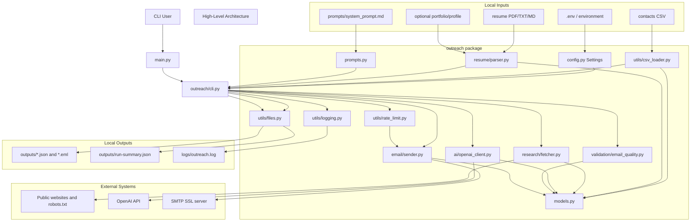

## Request Flows

This is not a request/response web application. The applicable runtime flows are CLI command processing, optional HTTP research, OpenAI generation, local artifact writing, and optional SMTP sending.

### CLI Run Flow

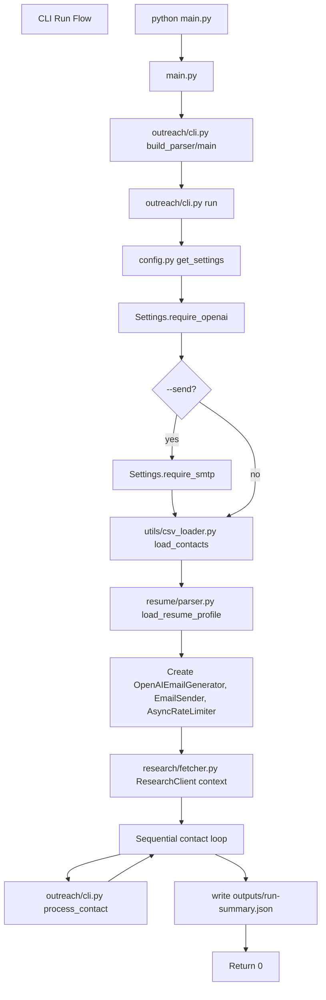

### Per-Contact Processing Flow

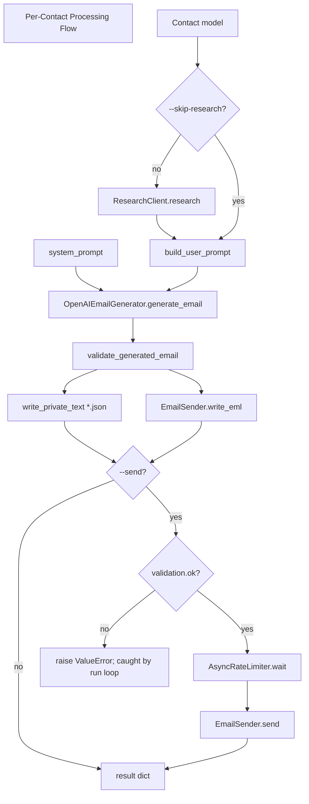

### HTTP Research Flow

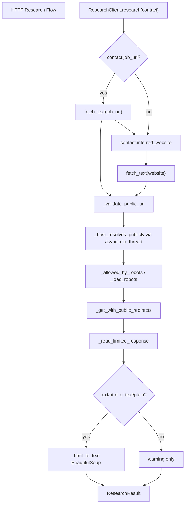

### Optional SMTP Send Flow

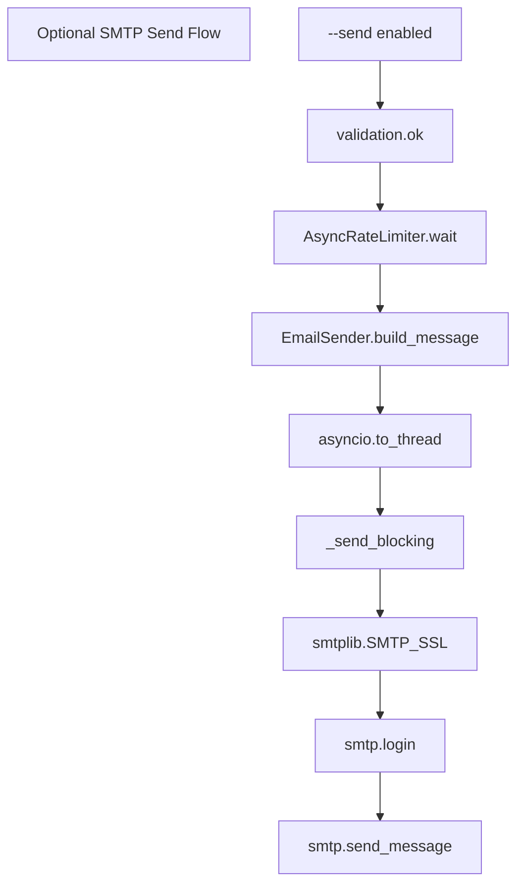

## Module Dependencies

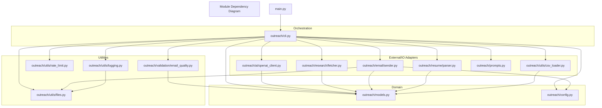

No circular dependency was found from the static import scan. `outreach/prompts.py` references `Contact` only under `TYPE_CHECKING`, so it is not a runtime import edge.

## File-Level Execution Maps

### Entrypoint to Artifacts

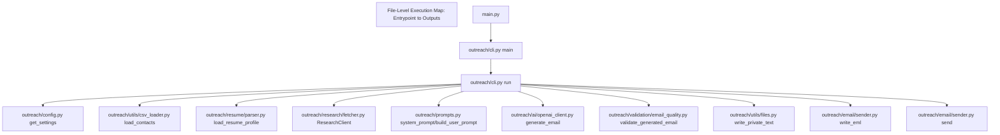

### Data Validation Boundaries

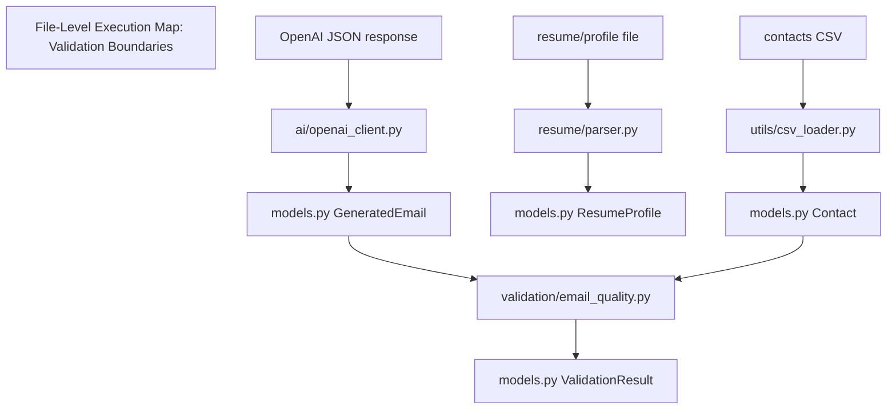

## Database/Data Flow

No database, ORM, repository layer, migrations, cache server, or message broker was found. Runtime data is in memory plus local files.

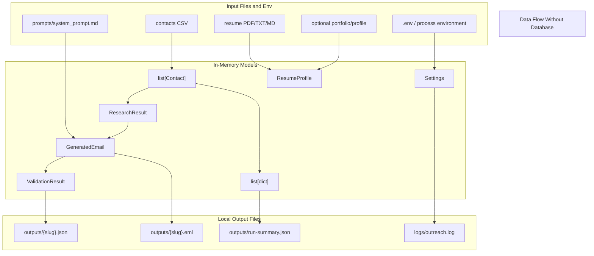

## Infrastructure

There is no infrastructure-as-code or deployment runtime definition in the repository.

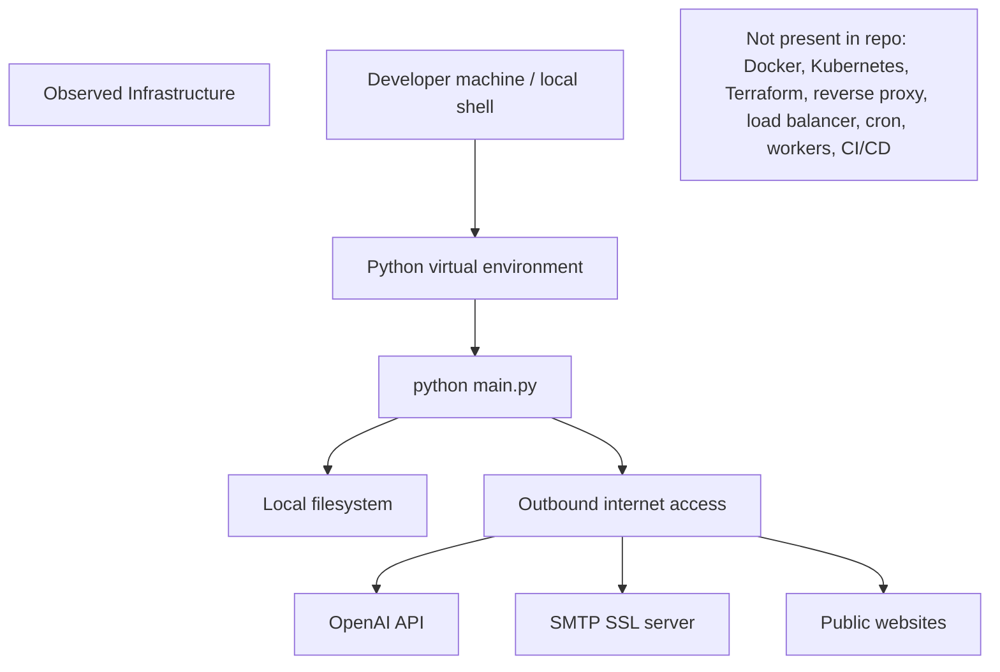

## Sequence Diagrams

### Full Dry-Run Sequence

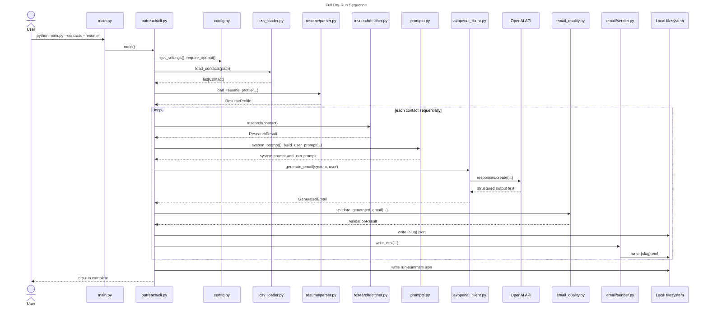

### Research Fetch Sequence

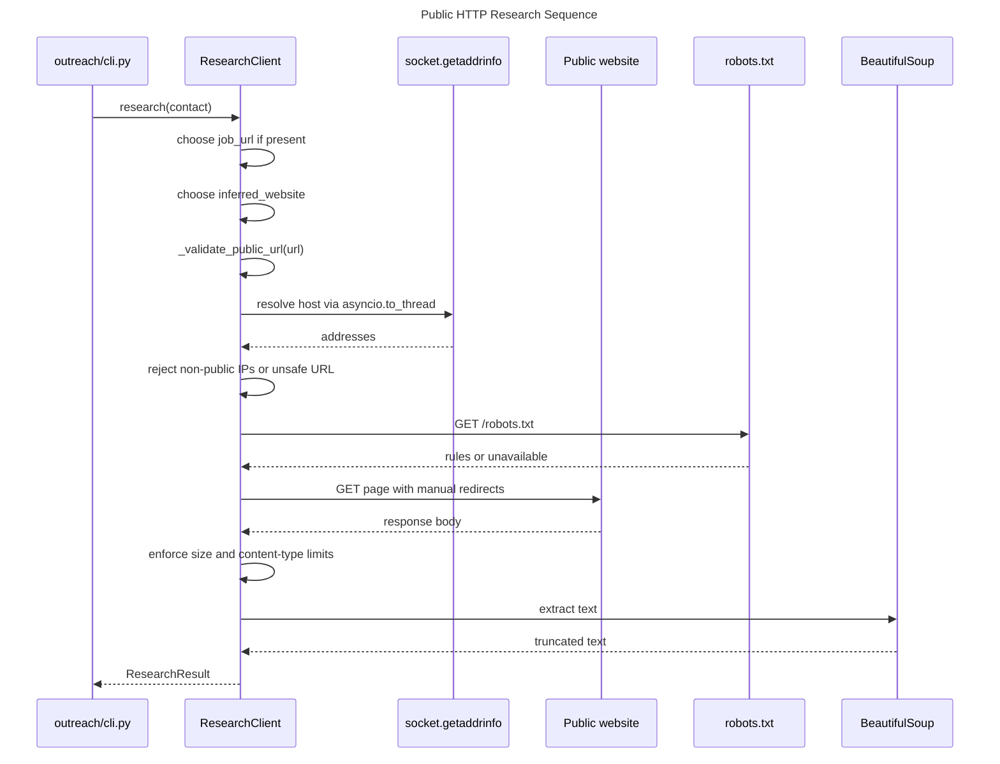

### Send-Enabled Sequence

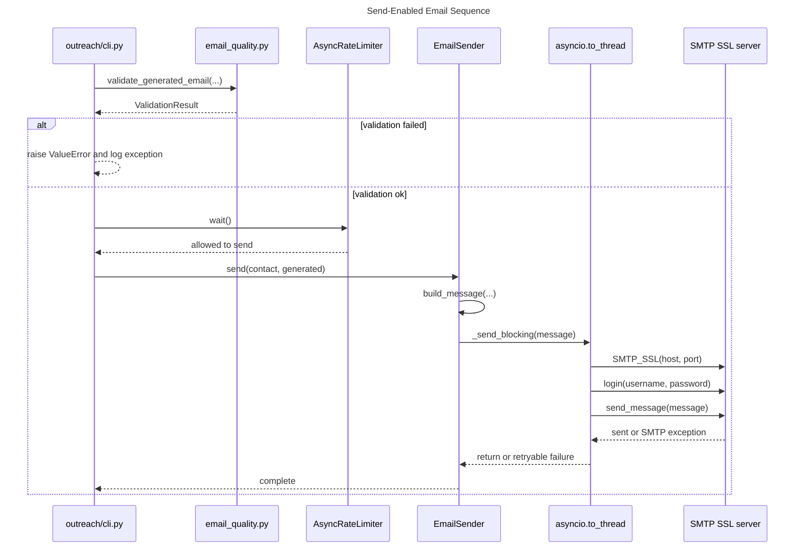

# Architectural Observations

- Bottlenecks: contacts are processed sequentially. This keeps behavior simple and conservative but can be slow because each contact may perform HTTP fetches plus an OpenAI API call.
- Bottlenecks: OpenAI generation is called once per contact and is on the critical path for both dry-run and send modes.
- Tight coupling: `outreach/cli.py` directly constructs and coordinates every component. This is reasonable for a small CLI but concentrates orchestration, error handling, and output concerns in one module.
- Circular dependencies: none found in the static import scan.
- Dead code: not enough evidence in code. All production modules are referenced either by `outreach/cli.py` or tests. No unreachable functions were proven.
- Risk area: `system_prompt.md` tells the model to read `job_description.md` and `profile.md`, but the actual code passes text inside a user prompt rather than giving file access to those names. This is a prompt wording mismatch, not a runtime file access path.
- Risk area: dry-run still requires `OPENAI_API_KEY`; there is no offline/mock generation mode in production code.
- Risk area: generated JSON and `.eml` may contain personal data. The code mitigates this with private-permission best effort and `.gitignore`, but Windows permission behavior is explicitly best effort in `set_private_permissions`.
- Risk area: public website research performs DNS checks before requests and redirect checks during requests, but DNS rebinding between validation and request cannot be fully ruled out from this code alone.
- Scaling concern: robots.txt cache is in memory per `ResearchClient` instance and per process only. There is no persistence or distributed coordination.
- Scaling concern: there is no queue, retry persistence, resume-on-failure checkpoint, or idempotency key. Failures are logged per contact, and successful results are accumulated for the current run summary.
- Security pattern: the code deliberately blocks localhost/private/link-local/non-global IP targets, URL credentials, unsafe redirects, oversized responses, unsupported content types, huge input files, and too-large PDFs.
- Security pattern: AI output is schema-constrained, parsed as JSON, validated by Pydantic, then checked with deterministic rules before sending.
- Observed architectural pattern: small layered CLI with explicit constructor injection from `run()` into `process_contact()`, shared domain models, adapter modules for external I/O, and local filesystem persistence.
- Missing abstraction: there is no repository/storage abstraction because no durable database exists. For this current scope, local file writes are direct and transparent.
- Missing abstraction: external adapters are not behind interfaces/protocols. Tests use monkeypatching and mock transports instead.

# Confidence & Evidence Notes

- High confidence: CLI startup and per-contact flow. Evidence: `main.py` and `outreach/cli.py`.
- High confidence: OpenAI integration. Evidence: `outreach/ai/openai_client.py` imports `AsyncOpenAI` and calls `responses.create`.
- High confidence: SMTP integration. Evidence: `outreach/email/sender.py` uses `smtplib.SMTP_SSL`; SMTP settings are in `outreach/config.py`.
- High confidence: public HTTP research behavior. Evidence: `outreach/research/fetcher.py` implements URL validation, DNS/IP checks, robots.txt, redirects, response limits, and BeautifulSoup extraction.
- High confidence: no database/message broker/cloud infra found. Evidence: full file list from `rg --files`, dependency files, and code search for database/queue/cloud terms.
- High confidence: no web API request lifecycle exists. Evidence: no web framework dependency or router/controller files; runtime entrypoint is `argparse` CLI.
- Inferred: OpenAI base URL is the SDK default. The code does not specify a custom base URL.
- Inferred: Gmail SMTP is the intended default SMTP provider because `SMTP_HOST` defaults to `smtp.gmail.com` and README documents Gmail App Password setup. The actual provider can be changed via environment.
- Unknown: exact production deployment environment. No deployment files exist in the repo.
- Unknown: actual `.env` values, real contact CSV paths, real resume/profile content, and real SMTP provider at runtime. `.env` is ignored and was not inspected.
- Not enough evidence in code: scheduled execution, background workers, webhooks, authentication flows, payment flows, or CI/CD execution. No files or imports implementing those concerns were present.
